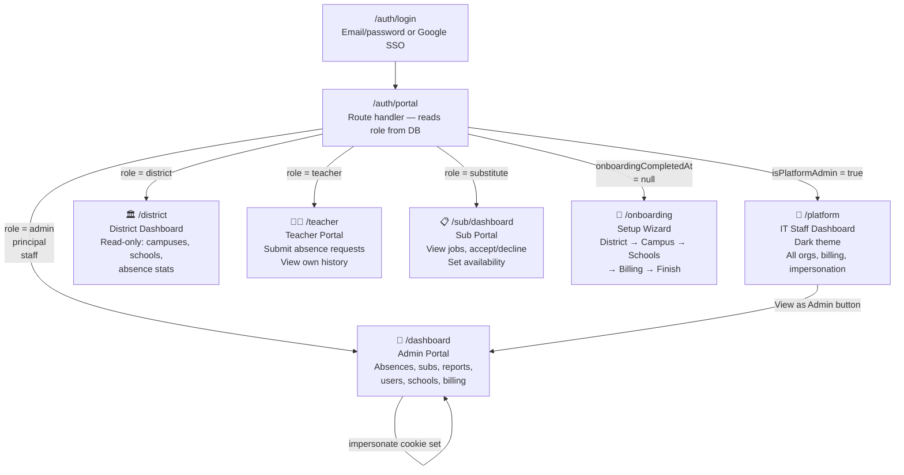
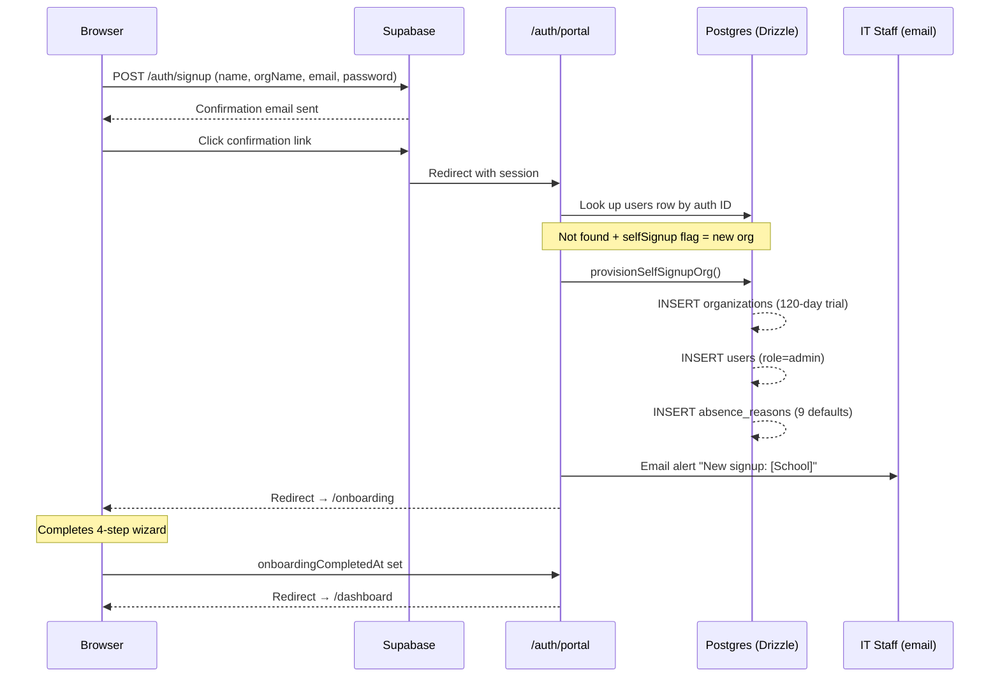
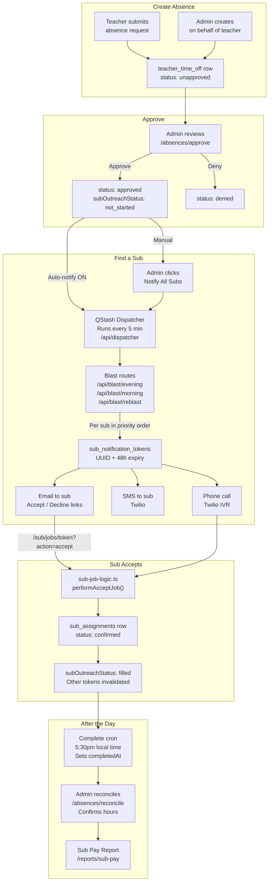

# SubHub Architecture

Four diagrams showing how the system fits together.

---

## 1. Portal Map — Who Goes Where

Every user who logs in is routed to one of six portals based on their role.

---

## 2. Auth Flow — From Signup to Dashboard

---

## 3. Core Data Flow — Absence to Coverage

---

## 4. Key File Map

```mermaid
flowchart LR
    subgraph SCHEMA["Data Layer"]
        S[("src/db/schema.ts\nAll 20+ Drizzle tables\norgs, campuses, schools,\nusers, absences, subs,\nbilling, platform")]
        IDX["src/db/index.ts\nDrizzle client\n(postgres superuser\nbypasses RLS)"]
        S --- IDX
    end

    subgraph AUTH["Auth"]
        MID["src/lib/supabase/middleware.ts\nSession refresh\nRoute protection"]
        CB["/auth/callback\nPKCE flow handler"]
        CONF["/auth/confirm\nImplicit flow\n(invite emails)"]
        PORT["/auth/portal\nRole-based redirect\nprovisionSelfSignupOrg()"]
    end

    subgraph PORTALS["Route Groups → Layouts"]
        APP_L["(app)/layout.tsx\nBilling gate\nOnboarding gate\nNotices count\nImpersonation"]
        PLAT_L["(platform)/layout.tsx\nisPlatformAdmin check"]
        TEACH_L["(teacher)/layout.tsx"]
        SUB_L["(sub)/layout.tsx"]
        DIST_L["(district)/layout.tsx\ndistrict role check"]
        OB_L["(onboarding)/layout.tsx"]
    end

    subgraph ACTIONS["Server Actions (key files)"]
        AA["(app)/absences/actions.ts\nAbsence CRUD\nSub assignment\nBlast trigger"]
        ADM["(app)/admin/actions.ts\nUser invite/import\nSchool management\nSub roster"]
        PLAT_A["(platform)/platform/actions.ts\nOrg management\nBilling records\nDelete org"]
        OB_A["(onboarding)/onboarding/actions.ts\nCampus creation\nSchool creation\nDiscount requests"]
    end

    subgraph CRON["Cron & Blast"]
        DISP["/api/dispatcher\nQStash publisher\nEvery 5 min"]
        BLAST_R["/api/blast/*\nPer-org blast routes\nCalled by QStash"]
        BILL_C["/api/cron/billing-alerts\nDaily 10am UTC\nTrial/overdue emails"]
        CLEAN["/api/cron/cleanup-invites\nNightly"]
    end

    subgraph EXTERNAL["External Services"]
        SB["Supabase\nAuth + Postgres\n+ Storage"]
        STRIPE["Stripe\nLive mode\n$10/seat/month"]
        RESEND["Resend\nTransactional email\n+ Webhook"]
        TWILIO["Twilio\nSMS + IVR calls"]
    end

    IDX --> APP_L
    IDX --> PLAT_A
    IDX --> AA
    PORT --> APP_L
    AUTH --> PORTALS
    ACTIONS --> EXTERNAL
    CRON --> EXTERNAL
    DISP --> BLAST_R
```

---

## Migration History

| # | File | What it added |
|---|------|---------------|
| 0000 | thick_rhodey | Initial schema |
| 0005 | school_directory | CA public school directory (3,194 schools) |
| 0006 | user_uploads | Avatar + resume storage |
| 0007–0013 | various | Pay model, priority orders, sub assignments, notifications, timezone, completedAt |
| 0014 | billing_and_signup | Stripe fields, billing events, onboardingCompletedAt |
| 0015 | cron_enabled | Kill switch per org |
| 0016 | platform_settings | Single-row settings table |
| 0017 | branding | appName, logoUrl |
| 0018 | enable_rls | RLS on all 19 tables |
| 0019 | platform_org | subhub-platform org |
| 0020 | price_and_seats | seatCount, pricePerSeatCents, stripePriceId |
| 0021 | district_campus | districtName on orgs, district role |
| 0022 | campuses_table | campuses table, schools.campusId FK |
| 0023 | billing_contact | billingContactName, billingContactEmail |
| 0024 | email_bounced | emailBounced, emailBouncedAt on users |
| 0025 | times_configured | timesConfigured on schools |
